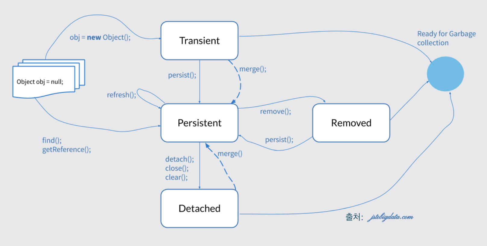

># JPA?

## JPA (Java Persistence Api)

Java에서 Object Relation Mapping (ORM) 기술 표준으로 사용되는 interface 모음

다음의 내용을 포함
- javax.persistance 패키지로 정의 된 API 그 자체
- JPQL (Java Persistence Query Language)
- Object/Relation Meta Data

[Jakarta Persistence 3.1 JavaDoc](https://jakarta.ee/specifications/persistence/3.1/apidocs/jakarta.persistence/jakarta/persistence/package-summary.html)

## Hibernate ORM

JPA 를 구현한 ORM Framework 

[Hibernate ORM](https://hibernate.org/orm/documentation/6.2/)
[Hibernate Java Doc](https://docs.jboss.org/hibernate/orm/6.2/javadocs/)

## Spring Data JPA

Spring 에서 JPA를 사용하기 편하도록 만든 Module


___

># JPA 

## ORM Mapping

### ORM Mapping?
OOP의 Object 와 Relation DataBase 의 Data를 자동으로 연결해주는 것 <br>
JPA에서는 @Entity를 통해 Entity 를 지원

### Entity

OR Mapping 에 이용되는 Object <br>

### Entity Mapping

[예제]()

#### @Entity
class 가 entity 임을 지정
- 사용하지 않을 경우 class는 object 생성시 entity로 인식되지 않아 IllegalArgumentException 을 발생시킴

```java
@Documented
@Target(TYPE)
@Retention(RUNTIME)
public @interface Entity {

    /**
     * (Optional) The entity name. Defaults to the unqualified
     * name of the entity class. This name is used to refer to the
     * entity in queries. The name must not be a reserved literal
     * in the Jakarta Persistence query language.
     */
    String name() default "";
}
```

#### @Id
Entity의 Primary Key를 지정
- @Entity class 내부에서 required
- 아래에 나와있는 Type 중 하나에만 사용해야 함

```java
/**
 * Specifies the primary key of an entity.
 * The field or property to which the <code>Id</code> annotation is applied 
 * should be one of the following types: any Java primitive type; 
 * any primitive wrapper type; 
 * 
 * String
 * java.util.Date
 * java.sql.Date
 * java.math.BigDecimal
 * java.math.BigInteger
 *
 * <p>The mapped column for the primary key of the entity is assumed 
 * to be the primary key of the primary table. If no <code>Column</code> annotation 
 * is specified, the primary key column name is assumed to be the name 
 * of the primary key property or field.
 * 
 * @since 1.0
 */
@Target({METHOD, FIELD})
@Retention(RUNTIME)

public @interface Id {}
```

#### @Column
entity class의 feild와 RDB의 Column을 mapping 할 때 사용됨
- default는 class feild name 과 일치하는 column 을 mapping
- 그 외에 다양한 옵션이 있음

```java

@Target({METHOD, FIELD}) 
@Retention(RUNTIME)
public @interface Column {

    /**
     * (Optional) The name of the column. Defaults to 
     * the property or field name.
     */
    String name() default "";

    /**
     * (Optional) Whether the column is a unique key.  This is a 
     * shortcut for the <code>UniqueConstraint</code> annotation at the table 
     * level and is useful for when the unique key constraint 
     * corresponds to only a single column. This constraint applies 
     * in addition to any constraint entailed by primary key mapping and 
     * to constraints specified at the table level.
     */
    boolean unique() default false;

    /**
     * (Optional) Whether the database column is nullable.
     */
    boolean nullable() default true;

    /**
     * (Optional) Whether the column is included in SQL INSERT 
     * statements generated by the persistence provider.
     */
    boolean insertable() default true;

    /**
     * (Optional) Whether the column is included in SQL UPDATE 
     * statements generated by the persistence provider.
     */
    boolean updatable() default true;

    /**
     * (Optional) The SQL fragment that is used when 
     * generating the DDL for the column.
     * <p> Defaults to the generated SQL to create a
     * column of the inferred type.
     */
    String columnDefinition() default "";

    /**
     * (Optional) The name of the table that contains the column. 
     * If absent the column is assumed to be in the primary table.
     */
    String table() default "";

    /**
     * (Optional) The column length. (Applies only if a
     * string-valued column is used.)
     */
    int length() default 255;

    /**
     * (Optional) The precision for a decimal (exact numeric) 
     * column. (Applies only if a decimal column is used.)
     * Value must be set by developer if used when generating 
     * the DDL for the column.
     */
    int precision() default 0;

    /**
     * (Optional) The scale for a decimal (exact numeric) column. 
     * (Applies only if a decimal column is used.)
     */
    int scale() default 0;
}
```

#### @GeneratedValue
primary key 의 값 생성 전략을 제공
- GenerationType.IDENTITY 등을 상황에 맞춰 사용함
- auto increment 등을 위해 사용함

```java

/**
 * Provides for the specification of generation strategies for the
 * values of primary keys. 
 *
 * <p> The <code>GeneratedValue</code> annotation
 * may be applied to a primary key property or field of an entity or
 * The use of the <code>GeneratedValue</code> annotation is only
 * required to be supported for simple primary keys.  Use of the
 * <code>GeneratedValue</code> annotation is not supported for derived
 * primary keys.
 *
 * @since 1.0
 */
@Target({METHOD, FIELD})
@Retention(RUNTIME)

public @interface GeneratedValue {

    /**
     * (Optional) The primary key generation strategy
     * that the persistence provider must use to
     * generate the annotated entity primary key.
     */
    GenerationType strategy() default AUTO;

    /**
     * (Optional) The name of the primary key generator
     * <p> Defaults to the id generator supplied by persistence provider.
     */
    String generator() default "";
}

```

## Persistence Context

### Persistence Context?

Jakarta Doc의 EntityManager를 보면
```text
...
A persistence context is a set of entity instances in which for any persistent entity identity there is a unique entity instance. Within the persistence context, the entity instances and their lifecycle are managed.
...
```
즉 Persistence Context 란 
- Entity Id에 따라 고유한 Entity 집합이며
- Persistence Context 안에서 Entity의 Life Cycle 을 관리하는 역할
- Server 와 DB 사이의 캐시 역할


### Entity Life Cycle

Persistence Context가 관리하는 Entity의 상태

| States     | Description                         |
|------------|-------------------------------------|
| Transient  | Persistenc Context 가 인식하지 못함(new)   |
| Persistent | Persistenc Context에 의해 관리됨 (managed) |
| Detached   | Persistenc Context에 의해 관리되었지만 현재는 아님 |
| Removed    | Persistenc Context에 의해 삭제됨          |



### EntityManager

#### EntityManager?
Persistence Context를 위한 Interface

```java
/**
 * Interface used to interact with the persistence context.
 *
 * An EntityManager instance is associated with 
 * a persistence context. A persistence context is a set of entity 
 * instances in which for any persistent entity identity there is 
 * a unique entity instance. Within the persistence context, the 
 * entity instances and their lifecycle are managed. 
 * The EntityManager API is used 
 * to create and remove persistent entity instances, to find entities 
 * by their primary key, and to query over entities.
 *
 * <p> The set of entities that can be managed by a given 
 * <code>EntityManager</code> instance is defined by a persistence 
 * unit. A persistence unit defines the set of all classes that are 
 * related or grouped by the application, and which must be 
 * colocated in their mapping to a single database.
 *
 * @since 1.0
 */
public interface EntityManager {
    /**
     * 중략
     */
}
```
#### Methods

persist
- entity를 managed,persistent 상태로 만듬
```java
public interface EntityManager {
    /**
     * Make an instance managed and persistent.
     * @param entity  entity instance
     * @throws EntityExistsException if the entity already exists.
     * (If the entity already exists, the <code>EntityExistsException</code> may 
     * be thrown when the persist operation is invoked, or the
     * <code>EntityExistsException</code> or another <code>PersistenceException</code> may be 
     * thrown at flush or commit time.) 
     * @throws IllegalArgumentException if the instance is not an
     *         entity
     * @throws TransactionRequiredException if there is no transaction when
     *         invoked on a container-managed entity manager of that is of type 
     *         <code>PersistenceContextType.TRANSACTION</code>
     */
    public void persist(Object entity);
}
```

remove
- entity를 removed 상태로 바꿈
```java
public interface EntityManager {
    /**
     * Remove the entity instance.
     * @param entity  entity instance
     * @throws IllegalArgumentException if the instance is not an
     *         entity or is a detached entity
     * @throws TransactionRequiredException if invoked on a
     *         container-managed entity manager of type 
     *         <code>PersistenceContextType.TRANSACTION</code> and there is 
     *         no transaction
     */
    public void remove(Object entity);
}
```

merge
- 최근 persistence context 에 entity를 merge
- entity를 persistence 상태로 만듬
- persistence context에 없을경우 primary key를 이용해 db를 조회해하여 entity 추가
```java
public interface EntityManager {
    /**
     * Merge the state of the given entity into the
     * current persistence context.
     * @param entity  entity instance
     * @return the managed instance that the state was merged to
     * @throws IllegalArgumentException if instance is not an
     *         entity or is a removed entity
     * @throws TransactionRequiredException if there is no transaction when
     *         invoked on a container-managed entity manager of that is of type 
     *         <code>PersistenceContextType.TRANSACTION</code>
     */
    public <T> T merge(T entity);
}
```

detach: entity를 detached 상태로 만듬
- detached 상태란 db와의 session이 끊기고 context에 의해 관리되지 않는 상태
- flush 되지 않은 변화들을 db에 동기화 되지 않도록 설정

```java

public interface EntityManager {
    /**
     * Remove the given entity from the persistence context, causing
     * a managed entity to become detached.  Unflushed changes made 
     * to the entity if any (including removal of the entity), 
     * will not be synchronized to the database.  Entities which 
     * previously referenced the detached entity will continue to
     * reference it.
     * @param entity  entity instance
     * @throws IllegalArgumentException if the instance is not an 
     *         entity 
     * @since 2.0
     */
    public void detach(Object entity);
}
```

flush
- persistence context 와 database 를 동기화
```java
public interface EntityManager {
    /**
     * Synchronize the persistence context to the
     * underlying database.
     * @throws TransactionRequiredException if there is
     *         no transaction or if the entity manager has not been
     *         joined to the current transaction
     * @throws PersistenceException if the flush fails
     */
    public void flush();
}
```

clear
- persistence context 의 내용을 초기화함
- 모든 entity는 detached 상태가됨
```java
public interface EntityManager {
    /**
     * Clear the persistence context, causing all managed
     * entities to become detached. Changes made to entities that
     * have not been flushed to the database will not be
     * persisted.
     */
    public void clear();
}
```

close
- EntityManager를 종료
```java
public interface EntityManager {
    /**
     * Close an application-managed entity manager. 
     * After the close method has been invoked, all methods
     * on the <code>EntityManager</code> instance and any 
     * <code>Query</code>, <code>TypedQuery</code>, and
     * <code>StoredProcedureQuery</code> objects obtained from 
     * it will throw the <code>IllegalStateException</code>
     * except for <code>getProperties</code>, 
     * <code>getTransaction</code>, and <code>isOpen</code> (which will return false).
     * If this method is called when the entity manager is
     * joined to an active transaction, the persistence
     * context remains managed until the transaction completes. 
     * @throws IllegalStateException if the entity manager
     *         is container-managed
     */
    public void close();
}
```

># Hibernate

Entity를 작성하였다 해서 ORM 이 일어나지는 않음<br>
Hibernate는 실제로 ORM을 하는 EntityManager 를 생성하는 EntityManagerFactory를 제공

## persistence.xml

persistence.xml에 ORM 을 위한 정보를 작성 <br>
EntityManagerFactory 를 이용해 EntityManager 객체를 생성
___

># Relation Mapping


## Bidirectional Relationship Vs UniDirectional Relationship


## Association Mapping

### DataBase 

FK가 다른 Table의 PK를 참조하여 관계의 주인이 됨

하지만 다음의 Query를 통해 서로를 조회할 수 있음

```mysql

select * from employee e join dept d on e.employee_id = d.dept_id;  
select * from dept d join employee e on d.dept_id = e.employee_id;
```

delete, insert 등 다른 query도 실행하는 과정에서 상황에 따라 Table에 양방향으로 반영됨

### JPA

Java의 객체는 Reference Variable 다른 객체의 해쉬값을 저장해 관계의 주인이 됨


Persistence Context 내에서 DB처럼 양방향으로 연결하려면 Persistence Context 에 관계에 대한 설정을 해주어야함
- 즉, 객체를 Persistence Context 내에서 단방향으로 서로 연결해야 양방향으로 mapping 이 가능함
- 단, DB 는 FK를 가진 쪽이 관계의 주인이 되지만, 객체는 서로 관계의 주인이 될 수 있음
- @JoinColumn @ManyToOne @OneToMany @OneToOne @ManyToMany 등 Annotatio을 활용해 Assosiation Mapping

#### @JoinColum
현재 Entity의 Object Type Feild 를 Persistence Context에서 Join 할 때 사용함을 표시 

```java
@Data
@AllArgsConstructor
@NoArgsConstructor
@Builder
@ToString
public class Employee {
    @Id
    @Column(name = "employee_id")
    @GeneratedValue(strategy = GenerationType.IDENTITY)
    private Integer id;
    
    @ManyToOne
    @JoinColumn(name = "dept_id")
    private Dept dept;
}
```

#### @ManyToOne

관계에서 Entity N개가 다른 Entity 1개를 참조함을 표시

```java
@Target({METHOD, FIELD}) 
@Retention(RUNTIME)

public @interface ManyToOne {

    /** 
     * (Optional) The entity class that is the target of 
     * the association. 
     *
     * <p> Defaults to the type of the field or property 
     * that stores the association. 
     */
    Class targetEntity() default void.class;

    /**
     * (Optional) The operations that must be cascaded to 
     * the target of the association.
     *
     * <p> By default no operations are cascaded.
     */
    CascadeType[] cascade() default {};

    /** 
     * (Optional) Whether the association should be lazily 
     * loaded or must be eagerly fetched. The EAGER
     * strategy is a requirement on the persistence provider runtime that 
     * the associated entity must be eagerly fetched. The LAZY 
     * strategy is a hint to the persistence provider runtime.
     */
    FetchType fetch() default EAGER;

    /** 
     * (Optional) Whether the association is optional. If set 
     * to false then a non-null relationship must always exist.
     */
    boolean optional() default true;
}
```

```java
@Data
@AllArgsConstructor
@NoArgsConstructor
@Builder
@ToString
public class Employee {
    @Id
    @Column(name = "employee_id")
    @GeneratedValue(strategy = GenerationType.IDENTITY)
    private Integer id;

    @ManyToOne
    @JoinColumn(name = "dept_id")
    private Dept dept;
}
```

#### @OneToMany
관계에서 Entity 1개 가 다른 Entity N개에게 참조됨을 표시 
- DB에는 Feild 와 mapping 되는 Colunm이 없지만 Entity 객체에 mapping 해 값을 가져오기 위해 필요함
```java
/*
 * Copyright (c) 2008, 2019 Oracle and/or its affiliates. All rights reserved.
 *
 * This program and the accompanying materials are made available under the
 * terms of the Eclipse Public License v. 2.0 which is available at
 * http://www.eclipse.org/legal/epl-2.0,
 * or the Eclipse Distribution License v. 1.0 which is available at
 * http://www.eclipse.org/org/documents/edl-v10.php.
 *
 * SPDX-License-Identifier: EPL-2.0 OR BSD-3-Clause
 */

@Target({METHOD, FIELD}) 
@Retention(RUNTIME)

public @interface OneToMany {

    /**
     * (Optional) The entity class that is the target
     * of the association. Optional only if the collection
     * property is defined using Java generics.
     * Must be specified otherwise.
     *
     * <p> Defaults to the parameterized type of
     * the collection when defined using generics.
     */
    Class targetEntity() default void.class;

    /** 
     * (Optional) The operations that must be cascaded to 
     * the target of the association.
     * <p> Defaults to no operations being cascaded.
     *
     * <p> When the target collection is a {@link java.util.Map
     * java.util.Map}, the <code>cascade</code> element applies to the
     * map value.
     */
    CascadeType[] cascade() default {};

    /** (Optional) Whether the association should be lazily loaded or
     * must be eagerly fetched. The EAGER strategy is a requirement on
     * the persistence provider runtime that the associated entities
     * must be eagerly fetched.  The LAZY strategy is a hint to the
     * persistence provider runtime.
     */
    FetchType fetch() default LAZY;

    /** 
     * The field that owns the relationship. Required unless 
     * the relationship is unidirectional.
     */
    String mappedBy() default "";

    /**
     * (Optional) Whether to apply the remove operation to entities that have
     * been removed from the relationship and to cascade the remove operation to
     * those entities.
     * @since 2.0
     */
    boolean orphanRemoval() default false;
}


```

```java
@Entity
@Data
@AllArgsConstructor
@NoArgsConstructor
@Builder
@ToString
public class Dept{

    @Id
    @Column(name = "dept_id")
    @GeneratedValue(strategy = GenerationType.IDENTITY)
    private Integer id;
    
    @Builder.Default
    @OneToMany(mappedBy = "dept")
    private List<Employee> emps = new ArrayList<>();
}
```

#### 양방향 mapping

객체의 양쪽에 @OneToMany와 @ManyToOne을 사용하여 양방향 연결이 가능함


### Persistence Casecade

Assosiation Mapping이 된 Entity를 사용하기 편하도록 Entity간 Persistence Cascade 를 제공
- @ManyToOne, @OneToMany를 보면 다양한 Cascade Type Option이 있음
- Cascade Type에 따라서 Persistence Context Status가 함께 반영됨

```java
public enum CascadeType { 
    ALL, 
    PERSIST, 
    MERGE, 
    REMOVE,
    REFRESH,
    DETACH
}
```

```java
@Target({METHOD, FIELD}) 
@Retention(RUNTIME)
public @interface ManyToOne {
    /**
     * (Optional) The operations that must be cascaded to 
     * the target of the association.
     *
     * <p> By default no operations are cascaded.
     */
    CascadeType[] cascade() default {};
}

@Target({METHOD, FIELD})
@Retention(RUNTIME)
public @interface OneToMany {
    /**
     * (Optional) The operations that must be cascaded to 
     * the target of the association.
     * <p> Defaults to no operations being cascaded.
     *
     * <p> When the target collection is a {@link java.util.Map
     * java.util.Map}, the <code>cascade</code> element applies to the
     * map value.
     */
    CascadeType[] cascade() default {};
}
```

### Fetch 전략

FetchType 은 JPA는 하나의 Entity 를 조회할 때, 연관관계에 있는 객체들을 가져오는 시점을 정함
- @ManyToOne FetchType
```java
public @interface ManyToOne {

    /** 
     * (Optional) Whether the association should be lazily 
     * loaded or must be eagerly fetched. The EAGER
     * strategy is a requirement on the persistence provider runtime that 
     * the associated entity must be eagerly fetched. The LAZY 
     * strategy is a hint to the persistence provider runtime.
     */
    FetchType fetch() default EAGER;
    
}

```

- @OneToMany FetchType

```java
public @interface OneToMany {
    
    /** (Optional) Whether the association should be lazily loaded or
     * must be eagerly fetched. The EAGER strategy is a requirement on
     * the persistence provider runtime that the associated entities
     * must be eagerly fetched.  The LAZY strategy is a hint to the
     * persistence provider runtime.
     */
    FetchType fetch() default LAZY;
}

```

- FetchType의 종류
```java
public enum FetchType {

    /** Defines that data can be lazily fetched. */
    LAZY,

    /** Defines that data must be eagerly fetched. */
    EAGER
}
```

| EAGER | LAZY |
|-------|------|
|       |      | 


